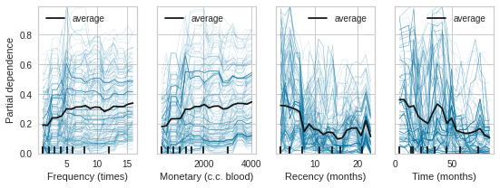
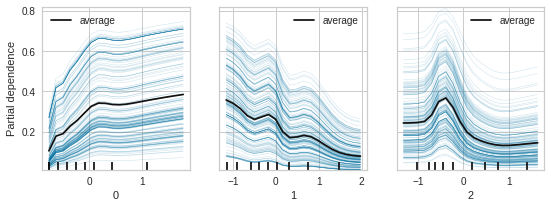

# Sagemaker Boilerplate report

The current exercise is an attempt at simplifying use of Sagemaker for Data Science exploration using Blood Donation dataset. 
In the process we can learn something about behaviour of data and better keep track of the whole modelling process.

## Data

columns : 
* Recency (months)  
* Frequency (times)
* Monetary (c.c. blood)  
* Time (months)
* whether he/she donated blood in March 2007  

**target : whether he/she donated blood in March 2007**

N (instances) : 748
Missing values : 0


### Relationship of different variables with target
```modelled with a RandomForestClassifier```  



Observations:
1. *Monetary (c.c. blood)* and *Frequency (times)* are essentially same variable and we can drop either from our analysis without any loss of information
2. We can observe that variables have a non-linear relationship with *target* and so Linear models alone may underfit the data
3. *Time (months)* appears to have an exponential decay like effect on target, with small peaks around 25-40 months. The time decay itself is not steep.
4. *Recency (months)* also appears to have time decay effect and target variable decays much steeper then saturates
5. *Frequency (times)* has a first order like increase followed by saturation of target variable
6. There are a few outliers in the data and variables appear to have skewed distributions

### Decomposing independent variables into their Principal components
```Using PCA with 3 components and modelling with RandomClassifier```
PCA will help remove the multicollinearity between *Monetary* and *Frequency* variables and it will also help if we decide to use a Logistic Regression model down the line.  

**Relationship between variables after using PCA transformation**


Observations:
1. *Frequency (times)* becomes a completely redundant variable because another highly correlated feature exists in feature space
2. *Monetary (c.c. blood)* has a much linear relationship than before
3. Other variables show roughly same relationship
4. This makes sense since the other 2 variables were largely un correlated to Monetary/Frequecy values

**Relationship of decomposed variables with target**


Observations:
1. After PCA there are only 3 variables (one of the highly correlated variables disappears)
2. Recency/Time behaviour is approximately represented by last 2 variables
3. First PC shows exponential increase-saturation similar to Monetary/Frequency

### Modelling assumptions

1. There is no timeseries like structure in the data
2. 3rd PC can be modelled as a spline with atleast 8-10 knots or a mixture of exponential and RBF to capture the bump in the middle and a decay overall
3. 1st and 2nd PC can be modelled with exponential functions or splines with 4-5 knots
4. Because the variables are not exactly uniformly distributed, knots can be placed at quantiles in data
5. The variables can be combined using a linear model with a log link to target
6. To keep track of model performance *log-loss* can be used as scoring metric
7. At this point we'll ignore the imbalance of classes in target variable

**Using the assumptions above to roughly model the target (starting from decomposed variables)**



Observations:
1. The rough selection of hyperparameters still yields a good `score (training log loss) = 0.45`
2. The behaviour across different instances (blue line) is very regular and the splines are able to capture the relationships highlighted before (for decomposed variables)
3. This model could be further tuned or supplemented with additional feature transformations to increase performance


